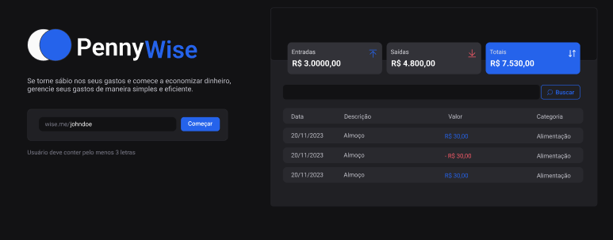
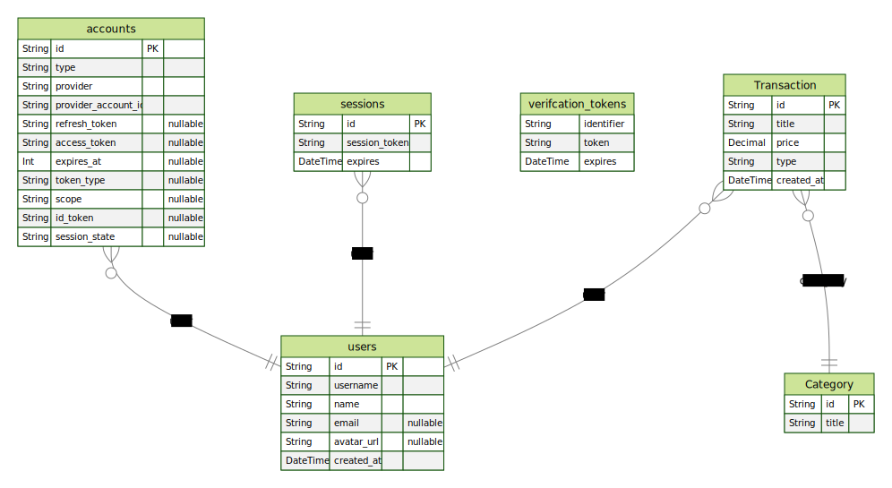

<h1 align="center"> PennyWise </h1>

Se você está procurando uma maneira fácil e eficiente de gerenciar suas finanças e economizar dinheiro, o PennyWise é a aplicação perfeita para você  

  <a href="#-tecnologias">Tecnologias</a>&nbsp;&nbsp;&nbsp;|&nbsp;&nbsp;&nbsp;
  <a href="#-projeto">Projeto</a>&nbsp;&nbsp;&nbsp;|&nbsp;&nbsp;&nbsp;
    <a href="#-entidades">Entidades</a>&nbsp;&nbsp;&nbsp;|&nbsp;&nbsp;&nbsp;
  <a href="#-layout">Layout</a>&nbsp;&nbsp;&nbsp;|&nbsp;&nbsp;&nbsp;
  <a href="#memo-licença">Licença</a>

  

 

  

## 🚀 Tecnologias

Esse projeto foi desenvolvido com as seguintes tecnologias:

- Prisma ORM
- NextJS
- Radix UI
- NextAuth
- Next SEO
- Styled Components
- Nookies

## 💻 Projeto

O PennyWise é uma aplicação de controle de gastos finaceiros de forma simples e eficaz.

- [Acesse o projeto final](https://pennywise-coral.vercel.app/)

 

## Entidades

  

## 🔖 Layout

Você pode visualizar o layout do projeto através [DESSE LINK](https://www.figma.com/file/s2Mg3jAQZMJg9NsPg9pDWi/pennywise?node-id=0%3A1&t=zvlyk9oO3mjlLptL-1). É necessário ter conta no [Figma](https://figma.com) para acessá-lo.

## :memo: Licença

Esse projeto está sob a licença MIT.

---

Feito com ♥ by gustavosalviato :wave: [entre em contato](https://www.linkedin.com/in/gustavo-salviato-910048212/)
